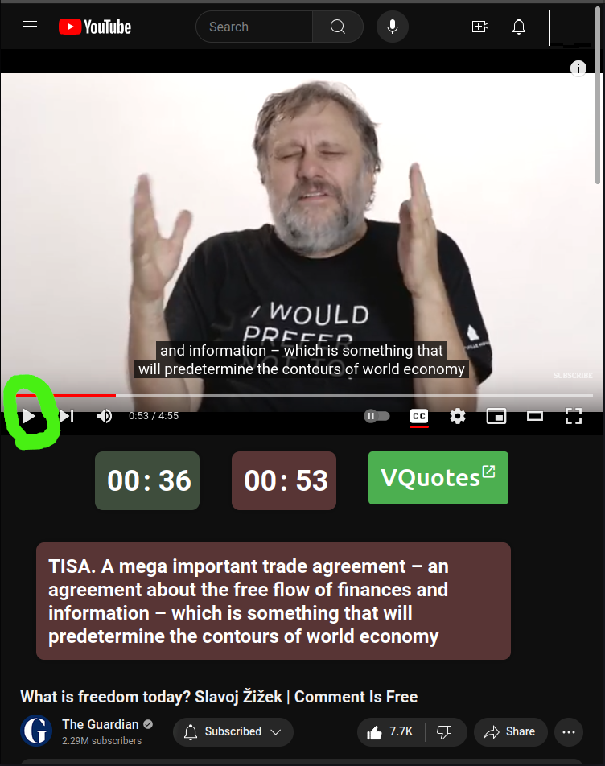

# What's this?

This is a Firefox Add On that helps users to mark video segments while watching Youtube.com, where they find an interesting quote to share to [VQuote](https://vquote.github.io).

# Usage:

1 - Open Youtube video page.

2 - Wait for VQuote panel to load below the video.

3 - Play the video from the play button to set the Start Time.

4 - Pause the video from the play button to set the End Time.

5 - If transcript is avaiable, it should appear in the panel.

6 - Click "VQuote" to launch a page on [VQuote](https://vquote.github.io) site in new window to review & insert the quote.

